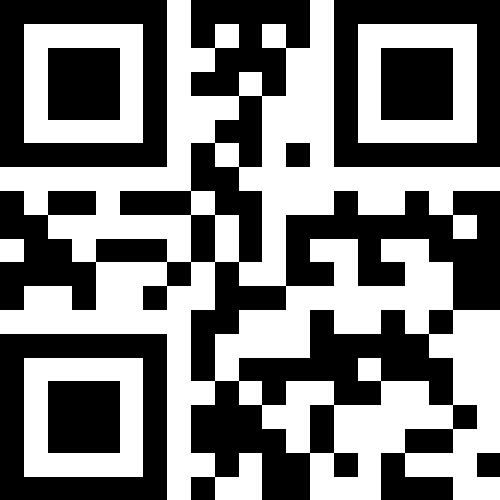

# NgQrGen
Fast and easy QR code generator.
An Angular (2+) Component wrapper for: https://www.npmjs.com/package/qrcode

## Installation
`npm i ng-qrgen`
Add NgQrgenModule to your angular module.

## Usage
`<ng-qrgen [options]="options"></ng-qrgen>`

## Options
The options interface can be found at
`import { QrGenOptions } from 'ng-qrgen';`
Which looks like:
```
{
    value: string;
    version: number;
    type: GenerationType;
    imageType?: ImageType;
    errorCorrectionLevel?: ErrorCorrectionlevel;
    margin?: number;
    scale?: number;
    width: number;
    maskPattern?: number;
    color?: {
        dark: string,
        light: string,
    };
}
```

* `value`: The value to be parsed as a QR code. Can be an url or any string.  
* `version`: The QR code version (1-40), higher means more black squares.  
* `type`: Image, Canvas, or Svg. 
* `imageType`: If you chose Image at `type`, determine which image type to use: Png, Jpeg, or Webp.  
* `errorCorrectionLevel`: The level of error correction: Low, Medium, Quartive, High. (See: https://www.npmjs.com/package/qrcode#error-correction-level).  
* `margin`: White space around the edges.  
* `scale`: Scale factor. A value of 1 means 1px per modules (black dots).  
* `width`: Size of the QR code.  
* `maskPattern`: Mask pattern used to mask the symbol.  
* `color`: The dark and light colors. Use Hex-codes.  